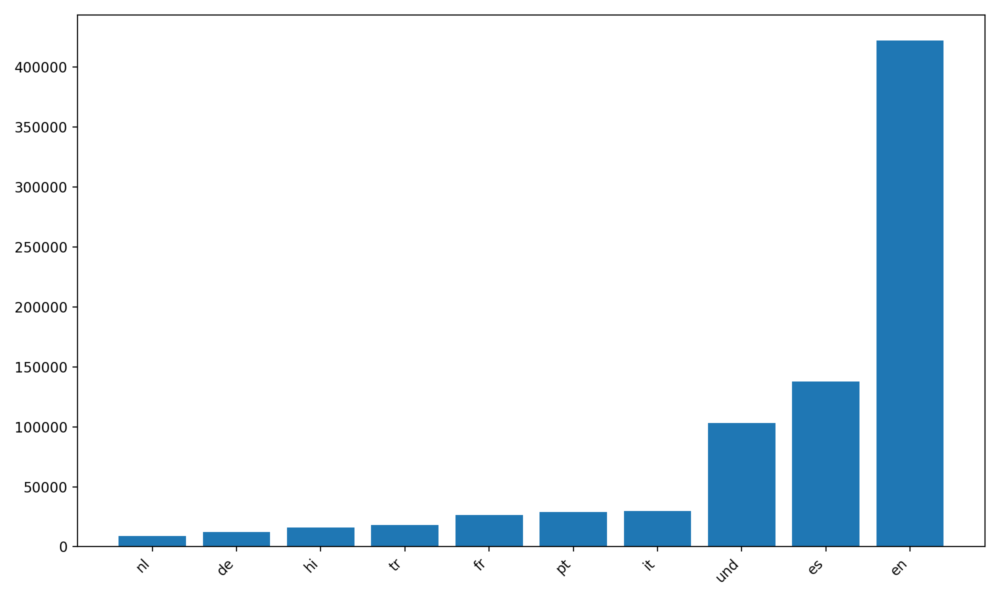
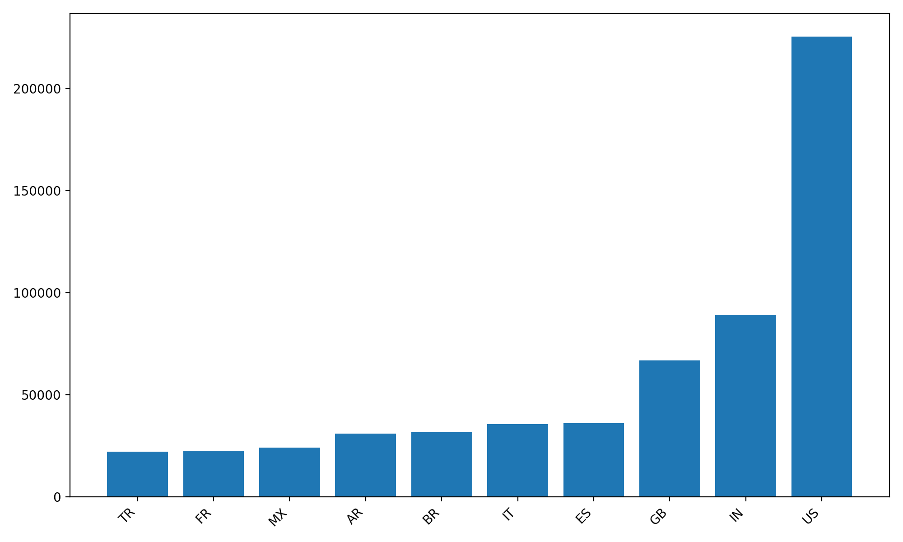
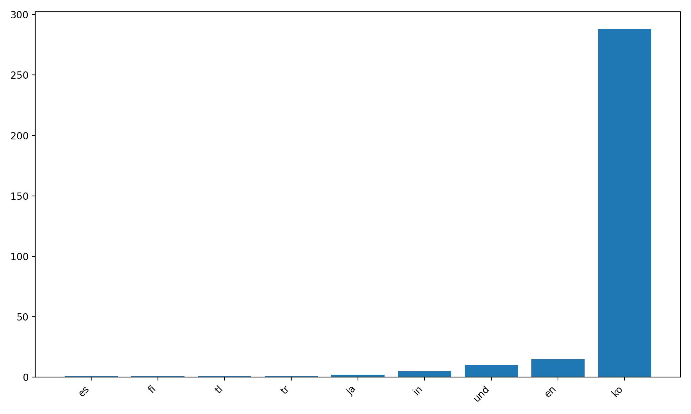
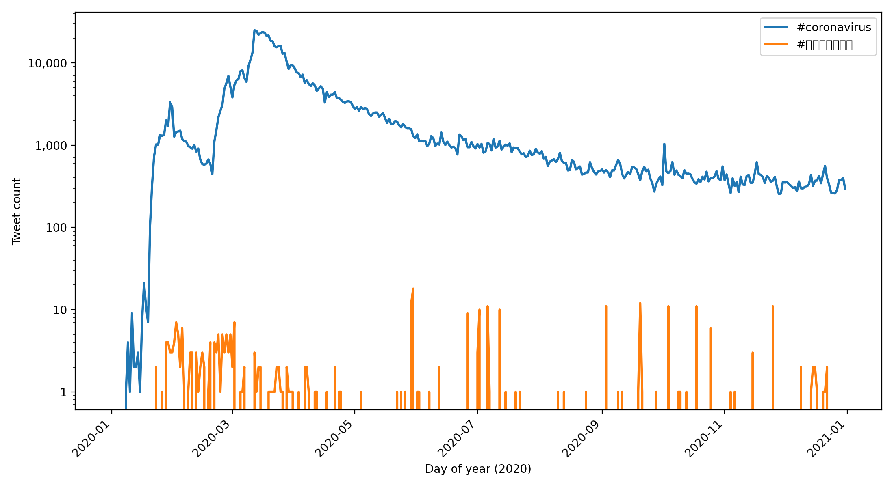

# Coronavirus Twitter Analysis (2020)

This project analyzes **~1.1 billion geotagged tweets from 2020** using a MapReduce-style pipeline to measure how COVID-related hashtags spread across **languages** and **countries**.

## What I built

### Map step (parallelized)
- For each day in 2020, I scan all geotagged tweets (stored as daily zip files).
- I count hashtag usage by:
  - **Language** (`.lang` outputs)
  - **Country** via `tweet["place"]["country_code"]` when available (`.country` outputs)
- The mapper is robust to missing location fields (e.g., tweets without `country_code`).

### Reduce step
- I aggregate all daily `.lang` outputs into `outputs/all.lang`
- I aggregate all daily `.country` outputs into `outputs/all.country`

### Visualization
- I generate top-10 bar charts for hashtag usage across languages and countries.
- I also generate a time-series plot showing daily hashtag usage over the year.

## Results

### Top languages and countries for #coronavirus

### Top languages and countries for #코로나바이러스

### Hashtag usage over time (2020)

## Tech used
- Python (json, zipfile, collections)
- MapReduce design pattern (map → reduce)
- Parallel job control with `nohup`, background jobs, and `tmux`
- Matplotlib for plotting
